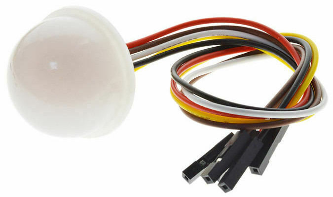
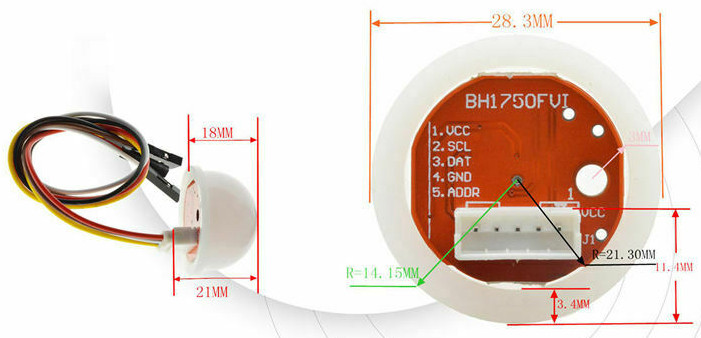
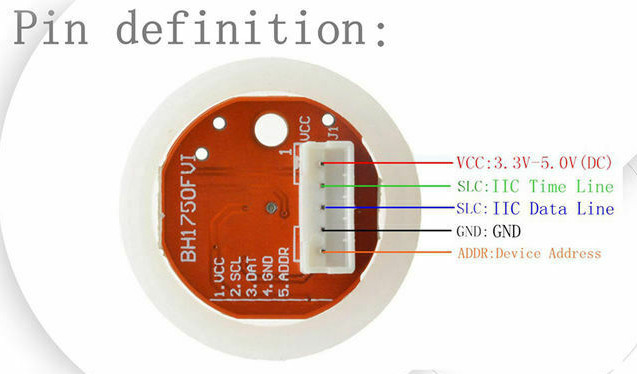

# BH1750 ambient light sensor

Senses

- [Light](../parameters/light.md) intensity (illumination)


## Resources

- [Datasheet](https://www.elechouse.com/elechouse/images/product/Digital%20light%20Sensor/bh1750fvi-e.pdf)


## ESensors Software

The [LightBH1750.h](../../src/LightBH1750.h) header declares the
LightBH1750 class derived from [ESensor](../classes.md#esensor)
supporting a BH1750 within the [ESensors](../classes.md) framework.

```cpp
#include <LightBH1750.h>

LightBH1750 light;

void setup() {
  Wire.begin();
  light.begin();
  light.setAutoRanging();
}

void loop() {
  float E = light.read();
}
```

### ESensors

- `RawBH1750`: raw 16bit sensor readings. 
- `QualityBH1750`: quality setting (0: HIGH, 1: HIGH2, 3: LOW).
- `TimeBH1750`: measurement time (MTreg value).


## Hardware

### [Adafruit BH1750 Ambient Light Sensor](https://learn.adafruit.com/adafruit-bh1750-ambient-light-sensor)


### [ESPHome BH1750 Ambient Light Sensor](https://esphome.io/components/sensor/bh1750.html)


### [GY-302 BH170 light sensor brightness sensor for Raspberry Pi](https://www.az-delivery.de/en/products/gy-302-bh1750-lichtsensor-lichtstaerke-modul-fuer-arduino-und-raspberry-pi)


### [Bh1750Fvi with light dome](https://www.ebay.de/itm/313537378784?chn=ps&_trkparms=ispr%3D1&amdata=enc%3A1sBBkBa-6RfClS7tqIW48lA86&norover=1&mkevt=1&mkrid=707-134425-41852-0&mkcid=2&itemid=313537378784&targetid=1596011701110&device=c&mktype=pla&googleloc=9042270&poi=&campaignid=14472331666&mkgroupid=125370287694&rlsatarget=pla-1596011701110&abcId=9300652&merchantid=111416633&gclid=EAIaIQobChMI4N3RsZO89wIVk-F3Ch2fuwEmEAQYBCABEgLo8_D_BwE)

Available on [eBay via sihugpiao2](https://www.ebay.de/str/sihugpiao2)








## Connection

Connect the chip to [Teensy](https://www.pjrc.com/teensy/pinout.html)
as follows:

| BH1750  | color  | Teensy      |
| ------- | ------ | ----------- |
| VCC/VIN | red    | 3.3V        |
| SCL     | brown  | SCL0 (19)   |
| SDA/DAT | white  | SDA0 (18)   |
| GND     | black  | GND         |
| ADDR    | yellow | GND or 3.3V |

The ADDR pin sets the I2C address of the chip:

| ADDR | address |
| ---- | ------- |
| GND  | 0x23    |
| 3.3V | 0x5C    |


## Library survey

For our purpose, the library by [Stefan Armborst](https://github.com/Starmbi) is most suitable:

- [hp_BH1750](https://github.com/Starmbi/hp_BH1750): non-blocking,
  TwoWire passed in begin(), auto-adjust gain and timing, well thought
  timing issues.


A search via the library manager of the Arduino IDE also results in (May 2022):

- [BH1750](https://github.com/claws/BH1750): flexible Wire interface,
  kind of non-blocking read. 2 gains and two measurement times.

- [BH1750_WE](https://github.com/wollewald/BH1750_WE): non-blocking?
  TwoWire passed to constructor. Very basic implementation.

- [BH1750FVI](https://github.com/PeterEmbedded/BH1750FVI):
  non-blocking? TwoWire passed to constructor. Very basic
  implementation.

- [BH1750FVI_RT](https://github.com/RobTillaart/BH1750FVI_RT):
  non-blocking read. TwoWire passed to constructor. Temperature
  correction.

- [M5_BH1750FVI](https://github.com/m5stack/M5_BH1750FVI):
  non-blocking, TwoWire passed in begin()

- [OneTime-BH1750](OneTime-BH1750): blocking read. TwoWire passed to
  constructor.

- [BH1750](https://github.com/jancoow/BH1730-Library): fixed I2C
  interface, blocking read only. x1, x2, 64, x128 gain.

- [UncleRus ESP-IDF Components
  library](https://github.com/UncleRus/esp-idf-lib): blocking data
  request.
