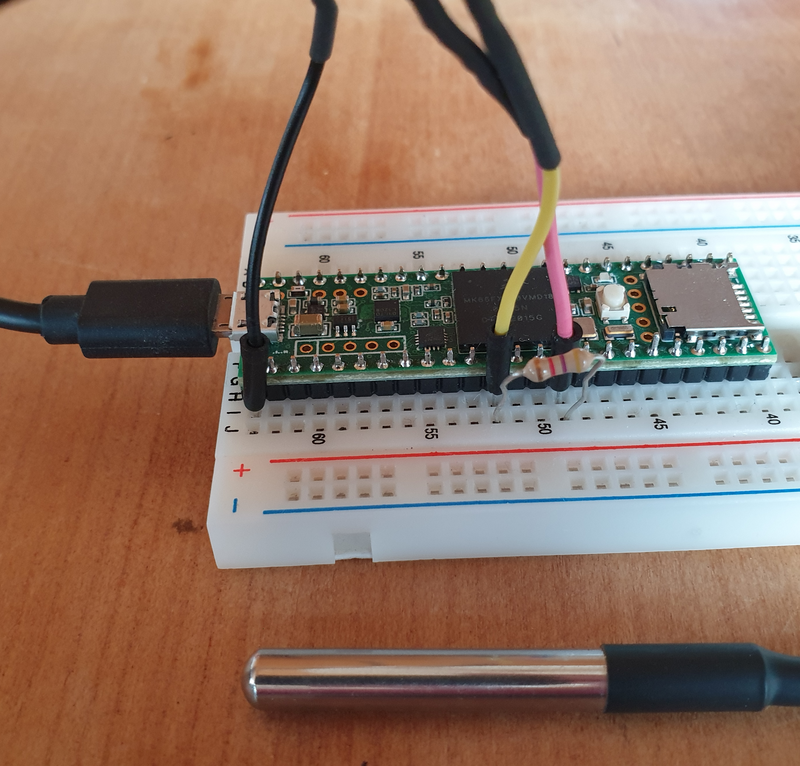

# Dallas DS18x20

Senses

- [temperature](../parameters/temperature.md)

This chip is controlled via an OneWire bus.


## Resources

- [Datasheet](https://datasheets.maximintegrated.com/en/ds/DS18B20.pdf)


## ESensors Software

The [TemperatureDS18x20.h](../../src/TemperatureDS18x20.h) header
declares the TemperatureDS18x20 class derived from
[ESensor](../classes.md#esensor) supporting a DS18x20 within the
[ESensors](../classes.md) framework.

```cpp
#include <TemperatureDS18x20.h>

uint8_t tempPin = 10;    // pin for DATA line of DS18x20 themperature sensor

TemperatureBME280 temp;

void setup() {
  temp.begin(tempPin);
}

void loop() {
  float T = temp.read();
}
```


## Hardware

You need a [pull-up
resistor](https://github.com/RobTillaart/DS18B20_RT#pull-up-resistor). See
[here](
https://create.arduino.cc/projecthub/TheGadgetBoy/ds18b20-digital-temperature-sensor-and-arduino-9cc806)
for a circuit diagram.



Connect the DS18B20 to the
[Teensy](https://www.pjrc.com/teensy/pinout.html) as follows:

- black wire: GND (left most pin on the Teensy)
- red wire: 3.3V (between pin 12 and 14 on the Teensy)
- yellow wire: data on pin 10 (or any other digital input pin).

In addition you need to connect the data pin to 3.3V via a 4.7kΩ
pullup resistance.  

For external as well as parasitic power mode see
[wiring](https://github.com/matmunk/DS18B20#wiring-the-ds18b20).


## Library survey

- [DS18x20_Temperature
  example](https://github.com/PaulStoffregen/OneWire/blob/master/examples/DS18x20_Temperature/DS18x20_Temperature.ino)

- [DallasTemperature](https://github.com/milesburton/Arduino-Temperature-Control-Library): non-blocking reads, select sensors by address or index.

- [microDS18B20](https://github.com/GyverLibs/microDS18B20):
  non-blocking reads of several temperature sensors on the same bus,
  with english documentation.


- [DS18B20_int](https://github.com/RobTillaart/DS18B20_INT): minimum
  library for one sensor per pin, non-blocking reads, only integer
  temperatures.

- [DS18B20_RT](https://github.com/RobTillaart/DS18B20_RT): minimum
  library for one sensor per pin, non-blocking reads, floating point
  temperatures.

- [NonBlockingDallas](https://github.com/Gbertaz/NonBlockingDallas):
  non-blocking with call-backs, based on
  [DallasTemperature](https://github.com/milesburton/Arduino-Temperature-Control-Library).

- [DS18B20](https://github.com/matmunk/DS18B20): auto detection of all
  connected sensors, blocking reads.

- [UncleRus ESP-IDF Components
  library](https://github.com/UncleRus/esp-idf-lib): blocking reads.
  

